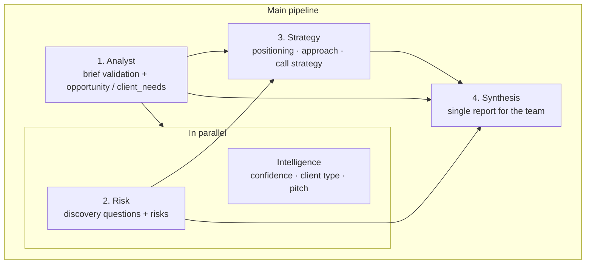

# Presales App — Backend API

REST API built with **Node.js** and **Express** for multi-agent presales analysis: a job post or client brief is turned into a structured report for a discovery call, plus standalone intelligence signals and a proposal draft. Models are called through the **OpenAI** API (JSON mode); report storage and authentication use **Supabase**.

---

## What it does

| Area | Description |
|------|-------------|
| **Presales pipeline** | Accepts `job_post` (required) and optionally client messages, team expertise, and constraints. Runs a chain of LLM agents and returns JSON: analysis, risks, strategy, synthesized report, and an **intelligence** block (confidence score, client type, pitch). |
| **Storage & analytics** | Authenticated users save analysis results in Supabase, list their reports, and view aggregated analytics over their own data. |
| **Proposal** | A separate endpoint builds an email-style proposal draft from an existing synthesis + intelligence payload (without re-running the full pipeline). |

**`POST /api/presales/analyze`** is public (no token). Persisting reports and user-scoped data requires a Supabase **Bearer** token.

For auth, RLS, and the `reports` table in detail, see [**AUTH.md**](./AUTH.md).

---

## Stack

- **Runtime:** Node.js  
- **Framework:** Express, `express-async-errors`, CORS  
- **AI:** OpenAI API (`openai` SDK; model set in `.env`)  
- **Database / auth:** Supabase (`@supabase/supabase-js`)

---

## Agent architecture

Agents live in `src/agents/`; system instructions are Markdown files in `src/skills/*.md` loaded into the prompt (JSON responses).



### Agents at a glance

| Agent | Skill file | Role |
|-------|------------|------|
| **1 — Analyst** | `analyst-agent.md` | Validates that input looks like a real project; if valid, outputs `opportunity_summary` and `client_needs` (main and hidden needs). Entry point for the chain. |
| **Intelligence** | `intelligenceAgent.md` | Runs **after** Analyst, **in parallel** with Risk. Confidence score (with reasons), client type classification, pitch draft. Does not block agents 2–4. |
| **2 — Risk & Discovery** | `risk-discovery-agent.md` | From Analyst output: open questions for the call and a catalog of risks / red flags. |
| **3 — Strategy** | `strategy-agent.md` | Combines Analyst + Risk into positioning, solution approach, tone, and desired call outcome. |
| **4 — Synthesis** | `synthesis-agent.md` | Final human-readable report plus a short prep note for the lead. |
| **Proposal** (standalone) | `proposalAgent.md` | Not part of the main orchestrator. Generates subject, greeting, proposal sections, signature, and metadata from supplied `synthesis_report` and `intelligence`. |

Orchestration: `src/services/agentOrchestrator.js`.

---

## Requirements

- **Node.js** 18+ (LTS recommended)
- **OpenAI** account with an API key
- **Supabase** project with email/password enabled and the `reports` migration applied (see [AUTH.md](./AUTH.md))

---

## Local development

### 1. Install dependencies

```bash
git clone <repository-url>
cd presales-app-be
npm install
```

### 2. Environment variables

Create a **`.env`** file in the repository root:

| Variable | Required | Description |
|----------|----------|-------------|
| `OPENAI_API_KEY` | yes | OpenAI API key |
| `OPENAI_MODEL` | no | Defaults to `gpt-4o` |
| `SUPABASE_URL` | yes | Supabase project URL |
| `SUPABASE_ANON_KEY` | yes | Publishable (anon) key — not the service role |
| `PORT` | no | HTTP port; defaults to `3000` |

Example (replace with your values):

```env
OPENAI_API_KEY=sk-...
OPENAI_MODEL=gpt-4o
SUPABASE_URL=https://xxxx.supabase.co
SUPABASE_ANON_KEY=eyJ...
PORT=3000
```

### 3. Run the server

```bash
# production-like
npm start

# watch mode for development
npm run dev
```

The server listens on `http://localhost:3000` (or your `PORT`). Available routes are printed on startup.

---

## API overview

| Method | Path | Auth |
|--------|------|------|
| `POST` | `/api/auth/signup` | — |
| `POST` | `/api/auth/login` | — |
| `GET` | `/api/auth/me` | Bearer |
| `POST` | `/api/reports` | Bearer |
| `GET` | `/api/reports` | Bearer |
| `GET` | `/api/reports/:id` | Bearer |
| `DELETE` | `/api/reports/:id` | Bearer |
| `GET` | `/api/analytics/summary` | Bearer |
| `POST` | `/api/presales/analyze` | — |
| `POST` | `/api/presales/analyze/save` | Bearer |
| `POST` | `/api/proposal/generate` | — |

Request bodies and token usage examples are documented in [**AUTH.md**](./AUTH.md).

---

## Repository layout

```
├── server.js              # Entry point, port, endpoint hints
├── src/
│   ├── app.js             # Express: CORS, JSON, routes
│   ├── config/            # env (PORT, OpenAI, Supabase)
│   ├── agents/            # Agent logic + runJsonAgent
│   ├── skills/            # Markdown system prompts
│   ├── services/        # Orchestrator, OpenAI, Supabase, reports, analytics
│   ├── controllers/
│   ├── routes/
│   └── middleware/
└── supabase/migrations/   # SQL for reports table (RLS)
```

---

## License

ISC (see `package.json`).
